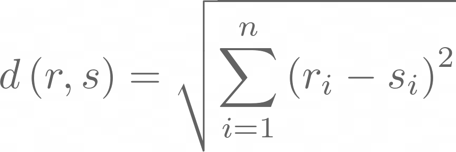
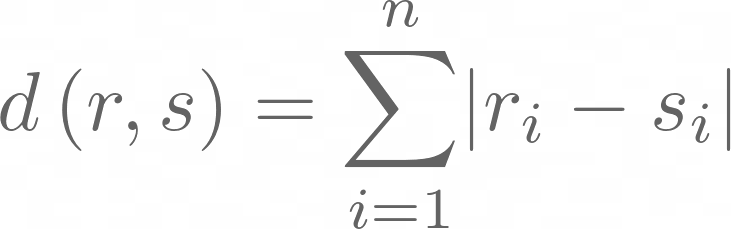

# Time-Series

-------------------
About
-------------------

Project Description: 

The purpose of this assignment was to explore representation and classification
techniques of a time series.  The data that was used for this assignment was
a [synthetic control data set](https://archive.ics.uci.edu/ml/datasets/Synthetic+Control+Chart+Time+Series).
The representation techniques that were used for this assignment were PAA - Piecewise
Aggregate Approximation and SAX - Symbolic Aggregate Approximation. The classification
was done by utilizing the Euclidean and Manhattan distance formulas.

Contributor List: Jesse Both

--------------------
Features
--------------------

* PAA and SAX Generation.
* Confusion Matrices to show data accuracy.

--------------------
Required Materials
--------------------
- MATLAB
- synthetic_control.data

--------------------
Resources and References
--------------------
- [MATLAB Documentation](https://www.mathworks.com/help/matlab/)

--------------------
Getting Started
--------------------
1. Load all the the files into MATLAB
2. Run the main file via the terminal by typing 'main' or pressing the 
play button with the main file as the active editor.
3. Open the terminal and input the window size 'c' value. This value must 
    be less than 60, the recommended value is 15.
4. The output to the terminal shows the accuracy of the data and the accuracy 
    of the PAA generation.
5. There are 5 figures that are displayed
    * Figure 1:
        - Confusion Matrix based on original data
    * Figure 2:
        - PAA representation from each class
    * Figure 3:
        - Confusion Matrix based on PAA generation
    * Figure 4: 
        - Comparison between SAX and PAA (cyclic class used)
    * Figure 5: 
        - SAX representation from each class

 

--------------------
Data Information
--------------------

In this data set, there are 6 classes, 600 rows and 60 columns.  Each row
represents a sample, every 100 rows represents a new class.  The classes are:
1. Normal
2. Cyclic
3. Increasing Trend
4. Decreasing Trend
5. Upward Shift
6. Downward Shift

Before any the confusion matrix was created, a training set needed to be created.  In order to create the best training set, the mean of each column
from each individual class was found.  This resulted in a training set that contained 1 row for each class.

In order to classify the data, the Euclidean and Manhattan distance formulas
were utilized. 

Euclidean: 

Manhattan: 

The accuracy of this data can be seen below: 

As you can see, there is no clear benefit in using one distance calculation
over the other.

--------------------
PAA Generation
--------------------

The purpose of the Piecewise Aggregate Approximation is to reduce the number of
edges within a data set so that a computer has an easier time processing its
information.  In order to do this the PAA generation function takes in the data
and a c value.  This c value represents the number of windows that will be created across the data set.  The spread of the data along with the generated PAA can be seen below:

In order to test the accuracy of this data, the training set also needs to be 
run through the PAA generation function.  The spread of the data is below:

--------------------
SAX Generation
--------------------

The process to create the Symbolic Aggregate Approximation was similar to implementing the PAA except there was an additional element that needed to be considered, the labels.  In order to
determine the labels, the ranges of the bounds for each label needs to be defined.
For this implantation, it was chosen that for every value that could be rounded 
to the nearest .5 (of the normalized data) would be its own label.  The labels
that were picked were A-M, A starting at -3 and M ending at +3. 

It can can be seen in the figure below that the PAA and SAX have the same shape, with SAX
having the addition of the labels.

